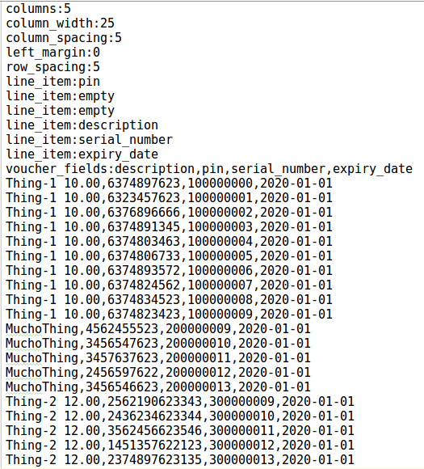
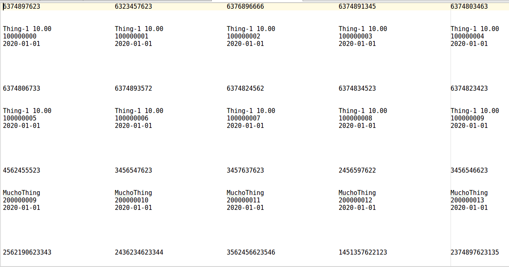

# Table Printer

## Description

An input file describing the desired format and a list of available vouchers will converted into a table. 
This table is ideally printed by a dot-matrix printer.

## Example

**Input**



**Output**



## How To

_Table Printer_ is a command-line tool. It is assumed the input file ends with the `.txt` extension

`python TablePrinter.py -h`will display the help menu

```
usage: TablePrinter.py [-h] input

Accept an input file containing formatting descriptors and a list of vouchers
to output in the given format

positional arguments:
  input       An input file containing the format descriptor and vouchers

optional arguments:
  -h, --help  show this help message and exit
 ```
## Testing

Use the following command to run tests:

```
python -m unittest discover -v
```

## Files

- _TablePrinter.py_
- _tests.py_
- _input.txt_ (a sample input file)

## Note

Developed with _Python 2.7.12_
